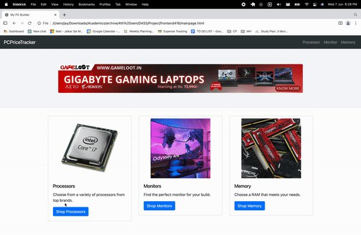

# PC Price Tracker

PC Price Tracker is an online platform developed to track and compare the prices of computer components and peripherals from various e-commerce websites in India. The project improved the website by implementing various sorting, filtering, and searching functionalities. 
I created the frontend, and worked with the team to extract component features as well as implement and write the backend requests. To enhance the website's functionality, we employed Python's regex logic to extract relevant features of PC components from the datasets provided by the client complemented them by incorporating additional features sourced through web scraping and external databases.

